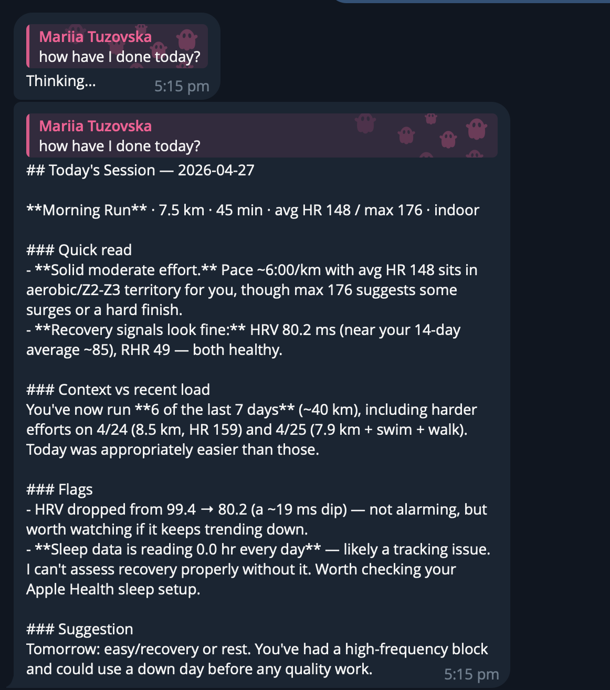

# vo2-bot

Telegram bot that pulls training data from Strava and Apple Health, stores it
in Postgres, and runs a Claude-backed coaching chat over the resulting metrics.



## Stack

| Concern     | Choice                                                 |
| ----------- | ------------------------------------------------------ |
| Language    | Go 1.25                                                |
| DB          | Postgres 16 (Docker, provisioned by Terraform)         |
| Migrations  | `golang-migrate`, embedded into the binary             |
| DB access   | `sqlc` (generated) + hand-written `pgx.CopyFrom` for bulk |
| Local infra | Terraform (`kreuzwerker/docker`) + Tilt dev loop       |
| Strava      | `net/http` — OAuth2 + activity sync                    |
| Telegram    | `go-telegram-bot-api/telegram-bot-api/v5` — long-poll, allowlisted chats |
| Claude      | Anthropic Messages API, model `claude-opus-4-7`        |

## Telegram commands

| Command   | Behaviour |
| --------- | --------- |
| `/start`, `/help` | Print usage. |
| `/strava` | Sync latest Strava activities for the calling chat. |
| `/apple`  | Import the newest `HealthAutoExport_*.zip` in `APPLE_ARCHIVE_DIR`. |
| `/coach`  | Open a coaching chat: builds a 14-day metrics snapshot (Strava activities + Apple HRV / RHR / sleep), embeds it in Claude's system prompt, and starts a multi-turn session. Plain-text follow-ups continue the same conversation. |
| `/end`    | Close the active coaching session. |

Access is gated by `TELEGRAM_ALLOWED_CHAT_IDS` (comma-separated). Empty = accept
all chats (dev mode).

## Strava

OAuth2 + on-demand activity sync. The startup log prints a one-time auth URL
bound to the first allowed chat ID; the operator opens it once to link Strava.
Tokens live in `strava_tokens` and refresh transparently before each call.

`Sync` is safe to run from any pod: a `pg_try_advisory_lock(athlete_id)`
serialises concurrent runs for the same athlete, and incremental progress is
tracked via `strava_sync_state.last_activity_at`. Rate-limit headers are mirrored
into `strava_rate_limit` after every API call.

## Apple Health

Apple HealthKit has no public REST API, so the bot reads zip archives produced
by the [Health Auto Export](https://www.healthexportapp.com/) iOS app. For now
the export is manual: drop the zip in `local/apple/` and run `/apple`. Eventually
this will be automated (paid HAE tier writing to GCS, or a similar drop +
notification) — deferred until the local flow has proven itself.

## Local run

Prereqs: Docker, Terraform, Go 1.25, Tilt.

```sh
make init       # one-time: scaffolds .env + terraform.tfvars, installs sqlc
# fill in .env (STRAVA_*, TELEGRAM_*, ANTHROPIC_API_KEY) and tfvars
make dev        # tilt up — Postgres + bot, hot-reloads on source changes
make clear      # tilt down + tf-down
```

`go run ./cmd/bot` works standalone if Postgres is up and `DATABASE_URL` points
at it. Migrations are embedded in the binary and applied on startup.

## Environment variables

See `.env.example`. Required: `DATABASE_URL`, `STRAVA_CLIENT_ID`,
`STRAVA_CLIENT_SECRET`, `STRAVA_REDIRECT_URL`, `TELEGRAM_BOT_TOKEN`,
`ANTHROPIC_API_KEY`. Optional: `APPLE_ARCHIVE_DIR` (default `local/apple`),
`HTTP_ADDR` (default `:8080`), `CLAUDE_MODEL` (default `claude-opus-4-7`),
`TELEGRAM_ALLOWED_CHAT_IDS` (empty = dev mode, accept all chats; first ID also
receives the startup Strava auth URL).

## Working with SQL

All SQL lives under `db/`: migrations in `db/migrations/`, sqlc queries in
`db/queries.sql`, codegen config in `db/sqlc.yaml`. Run `make sqlc` to
regenerate `internal/store/queries/`. Hand-written `pgx.CopyFrom` is used for
bulk inserts that sqlc can't express (see `internal/apple/store.go`).
